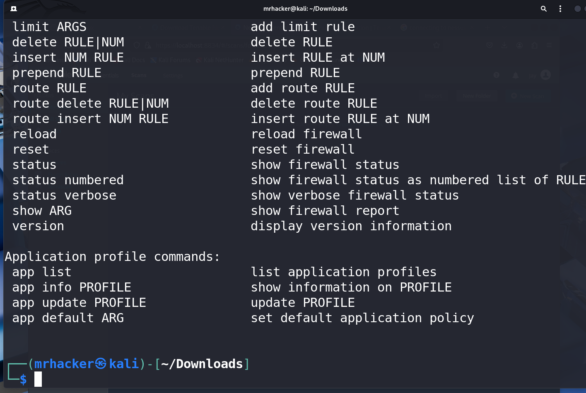
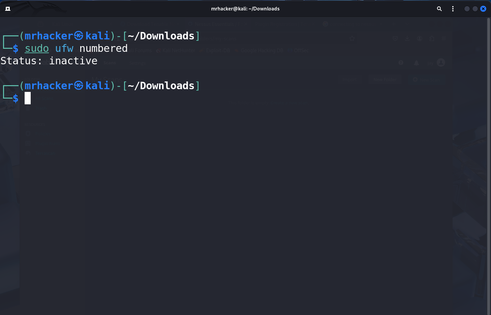
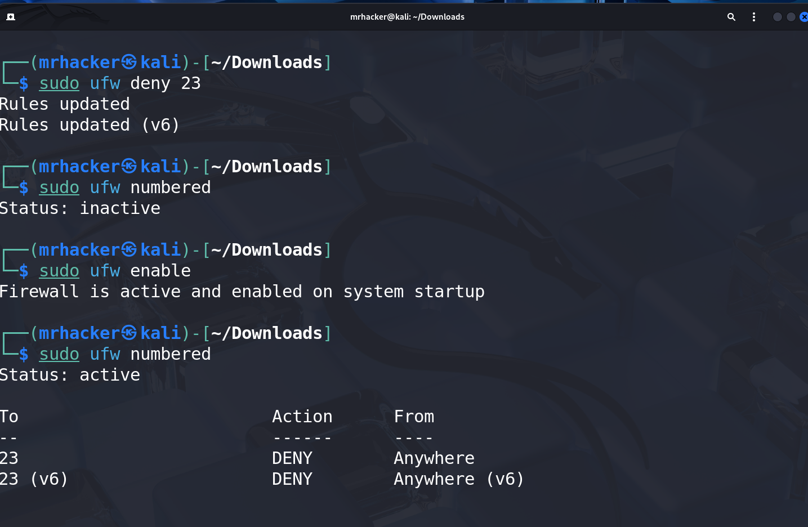
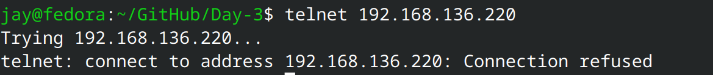
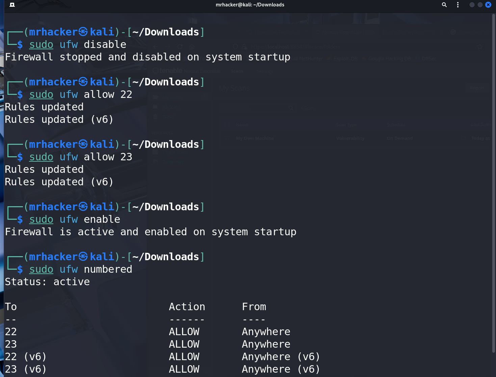
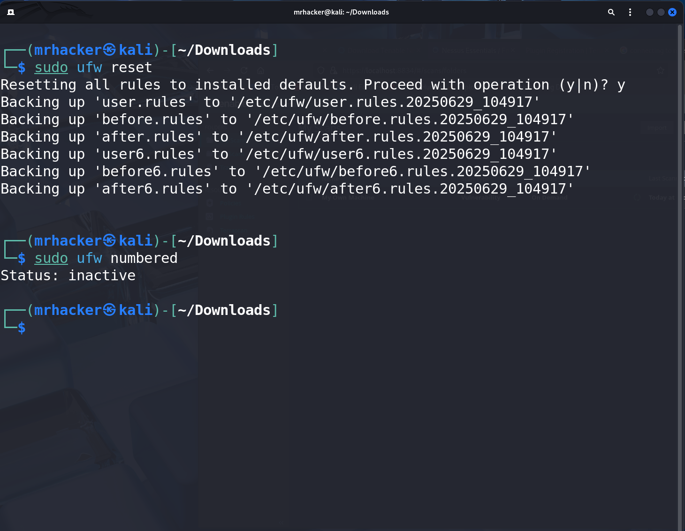

# Elevated Labs Internship Solutions

# Task 1
## Opening Firewall Configuration Tool(UFW)


# Task 2
## List Current Firewall Rules
Command : ```sudo ufw numbered```


# Task 3
## Adding Inbound Rule Port 23
Command : ```sudo ufw deny 23```


# Task 4
## Test the rule by connecting
command : ```telnet {ip_of_machine}```


# Task 5
## Allow Port 22 (SSH)
command : ```sudo ufw allow 22```


# Task 6
## Remove test block rule
command : ```sudo ufw reset```


# Task 7
## How does Firewall Filters Traffic
Firewall Works by Checking the Incoming Packet Header and match that based on predefined rules, If the rule says allow then only it will allow the packet into the Network if not then it will block the packet thus providing security
